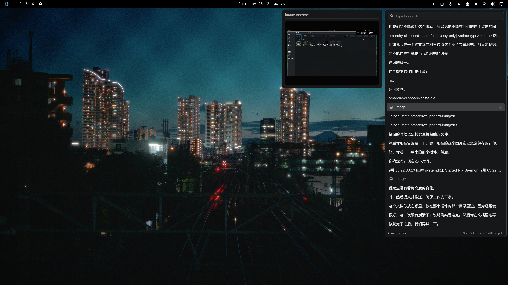

# HANCORE Clipboard

HANCORE Clipboard is an Omarchy bar-widget plugin for browsing and pasting
clipboard history. It uses Omarchy's original clipboard implementation as its
backend and adds a more convenient interface around it.



The panel keeps the image preview on the left and the clipboard history on the
right.

## What this plugin changes

The plugin does not invent a new clipboard format or a second set of paste
rules. It reuses Omarchy's native clipboard history, native image files, native
paste helpers, and native terminal/GUI paste behavior.

It adds two conveniences:

- The image row has an action for pasting the image's source file path as text.
- `Super+Ctrl+V` opens the panel at the mouse pointer and uses the same edge
  avoidance behavior as Omarchy's original cursor-based panel placement. The
  top-bar button continues to open it from the fixed bar position.

## Features

- Native Omarchy text and image clipboard history.
- Native Omarchy image storage and paste behavior.
- Top-bar clipboard button using Omarchy's bar integration.
- Cursor-positioned shortcut with automatic screen-edge avoidance.
- Image preview on the left and history menu on the right.
- Image file-path paste from the arrow action on an image row.
- Display-only cleanup of leading whitespace and punctuation-only entries;
  native history data is not changed.
- No `cliphist`, replacement clipboard watcher, or second clipboard daemon.

## Installation

Install the plugin with Omarchy's plugin manager:

```sh
omarchy plugin add https://github.com/iamcheyan/omarchy-clipboard.git --enable
```

The plugin provides a `bar-widget` entry point. If the button is not placed
automatically, add **HANCORE Clipboard** to the right side of the top bar.

Click the clipboard button to open the panel at the bar. Press `Super+Ctrl+V`
to open it near the mouse pointer. Selecting an item pastes it into the focused
application. For an image, click the arrow on the right side of its row to
paste the native image file path instead.

## Omarchy native integration

The plugin intentionally reuses Omarchy's existing state and helper commands:

- Text and image entries come from `~/.local/state/omarchy/clipboard-history.json`.
- Native image files are stored under
  `~/.local/state/omarchy/clipboard-images/`.
- Image paste uses `omarchy-clipboard-paste-file`.
- Text paste uses Omarchy's native history-aware paste helper.
- The image-path action uses universal paste behavior: terminals receive
  `Shift+Insert`, while graphical applications receive `Ctrl+V`.

The plugin does not install `cliphist`, replace Omarchy's clipboard watcher, or
copy the original image data into a second history store.

## Dependencies

The required runtime components are provided by Omarchy and the normal desktop
installation:

- Omarchy Quickshell;
- Hyprland and `hyprctl`;
- Wayland clipboard utilities `wl-copy` and `wl-paste`;
- Python 3 standard library for the image-path universal-paste helper.

No additional clipboard service is required.

## Uninstallation

Disable or remove the plugin through Omarchy's plugin manager. This removes the
top-bar widget and the plugin-owned runtime binding. Omarchy's native clipboard
history and image files remain available after the plugin is removed.

## Validation

From the plugin repository root:

```sh
omarchy plugin validate .
qmllint -I "${OMARCHY_PATH:-/usr/share/omarchy}/shell" \
  ClipboardPanel.qml bar/widget.qml \
  apps/hancore-clipboard/modules/clipboard/ClipboardDialog.qml
python3 -m py_compile scripts/*.py
```

## License

MIT. See [LICENSE](LICENSE).

---

# 中文说明

HANCORE Clipboard 是一个 Omarchy 顶栏剪贴板插件，用于浏览和粘贴剪贴板历史。它使用 Omarchy 原版剪贴板实现作为后端，并在此基础上提供更方便的操作界面。


面板左侧是图片预览，右侧是剪贴板历史菜单。

## 插件做了什么

插件没有创造新的剪贴板格式，也没有建立第二套粘贴规则。它直接复用 Omarchy 原生的剪贴板历史、原生图片文件、原生粘贴脚本，以及原生的终端/图形应用粘贴行为。

插件额外提供两个便利功能：

- 图片条目增加“把图片源文件地址作为文本粘贴”的操作。
- 按下 `Super+Ctrl+V` 时，面板会出现在鼠标光标附近，并使用与 Omarchy 原版光标面板相同的屏幕边缘避让逻辑。点击顶栏按钮时，仍然从顶栏固定位置打开。

## 功能

- 使用 Omarchy 原生的文本和图片剪贴板历史。
- 使用 Omarchy 原生的图片存储和粘贴行为。
- 在顶栏提供剪贴板按钮，并使用 Omarchy 的顶栏集成。
- 快捷键打开时跟随光标，并自动避开屏幕边缘。
- 左侧图片预览、右侧历史菜单。
- 点击图片条目右侧箭头，把图片文件地址粘贴为文本。
- 只在显示层清理行首空白、隐藏只有标点符号的条目，不修改原生历史数据。
- 不安装 `cliphist`，不替换系统剪贴板监听器，也不增加第二个剪贴板守护进程。

## 安装

使用 Omarchy 插件管理器安装：

```sh
omarchy plugin add https://github.com/iamcheyan/omarchy-clipboard.git --enable
```

插件提供 `bar-widget` 入口。如果按钮没有自动加入顶栏，可以把 **HANCORE Clipboard** 添加到顶栏右侧。

点击顶栏剪贴板按钮，会在顶栏固定位置打开面板。按下 `Super+Ctrl+V`，会在鼠标附近打开面板并自动避让。选择条目即可粘贴到当前获得焦点的应用。对于图片，点击条目右侧箭头即可粘贴原生图片文件地址。

## 与 Omarchy 原生实现的关系

插件有意复用 Omarchy 已有的状态和辅助脚本：

- 文本和图片条目来自 `~/.local/state/omarchy/clipboard-history.json`。
- 原生图片文件保存在 `~/.local/state/omarchy/clipboard-images/`。
- 图片粘贴使用 `omarchy-clipboard-paste-file`。
- 文本粘贴使用 Omarchy 原生的历史感知粘贴辅助脚本。
- 图片地址操作使用万能粘贴逻辑：终端发送 `Shift+Insert`，图形应用发送 `Ctrl+V`。

插件不会安装 `cliphist`，不会替换 Omarchy 原有的剪贴板监听器，也不会把原始图片复制到第二套历史存储中。

## 依赖

所需运行环境由 Omarchy 和正常的桌面安装提供：

- Omarchy Quickshell；
- Hyprland 和 `hyprctl`；
- Wayland 剪贴板工具 `wl-copy`、`wl-paste`；
- 用于图片地址万能粘贴辅助脚本的 Python 3 标准库。

不需要额外安装剪贴板服务。

## 卸载

通过 Omarchy 插件管理器禁用或删除插件。插件自己的顶栏按钮和运行时快捷键会被移除；Omarchy 原生剪贴板历史和图片文件会继续保留。

## 验证

在插件仓库根目录执行：

```sh
omarchy plugin validate .
qmllint -I "${OMARCHY_PATH:-/usr/share/omarchy}/shell" \
  ClipboardPanel.qml bar/widget.qml \
  apps/hancore-clipboard/modules/clipboard/ClipboardDialog.qml
python3 -m py_compile scripts/*.py
```

## 许可证

MIT，详见 [LICENSE](LICENSE)。

---

# 日本語

HANCORE Clipboard は、クリップボード履歴を閲覧して貼り付けるための Omarchy 用トップバープラグインです。バックエンドには Omarchy 標準のクリップボード実装をそのまま使用し、その上に使いやすい操作画面を提供します。


パネルでは左側に画像プレビュー、右側にクリップボード履歴を表示します。

## このプラグインの方針

新しいクリップボード形式や別の貼り付けルールは作りません。Omarchy 標準のクリップボード履歴、画像ファイル、貼り付けヘルパー、ターミナルと GUI アプリの標準動作をそのまま再利用します。

追加する便利な機能は次の二つです。

- 画像行に、画像の元ファイルパスをテキストとして貼り付ける操作を追加します。
- `Super+Ctrl+V` ではマウスポインター付近にパネルを開き、Omarchy 標準のカーソル位置パネルと同じ画面端回避を行います。トップバーのボタンから開く場合は、従来どおり固定されたバー位置を使います。

## 主な機能

- Omarchy 標準のテキスト・画像クリップボード履歴。
- Omarchy 標準の画像保存と貼り付け動作。
- Omarchy のトップバー統合を使うクリップボードボタン。
- ショートカット使用時はカーソル位置に表示し、画面端を自動回避。
- 左側の画像プレビューと右側の履歴メニュー。
- 画像行の矢印から画像ファイルパスをテキストとして貼り付け。
- 表示時だけ行頭の空白を整理し、句読点だけの項目を非表示。標準の履歴データは変更しません。
- `cliphist`、別の監視機構、別のクリップボードデーモンは追加しません。

## インストール

Omarchy のプラグインマネージャーからインストールします。

```sh
omarchy plugin add https://github.com/iamcheyan/omarchy-clipboard.git --enable
```

このプラグインは `bar-widget` エントリーポイントを提供します。ボタンが自動的に配置されない場合は、トップバー右側に **HANCORE Clipboard** を追加してください。

トップバーのボタンをクリックするとバーの固定位置に開きます。`Super+Ctrl+V` ではマウスポインター付近に開き、画面端を避けます。項目を選択するとフォーカス中のアプリケーションへ貼り付けます。画像の場合は行の右端の矢印から、標準の画像ファイルパスを貼り付けられます。

## Omarchy 標準機能との統合

- テキストと画像の項目は `~/.local/state/omarchy/clipboard-history.json` から読み込みます。
- 標準の画像ファイルは `~/.local/state/omarchy/clipboard-images/` に保存されます。
- 画像の貼り付けには `omarchy-clipboard-paste-file` を使用します。
- テキストの貼り付けには Omarchy 標準の履歴対応ヘルパーを使用します。
- 画像パスの貼り付けは Universal Paste を使い、ターミナルには `Shift+Insert`、GUI アプリには `Ctrl+V` を送信します。

`cliphist` はインストールせず、Omarchy のクリップボード監視を置き換えず、元画像を別の履歴ストレージへ複製もしません。

## 依存関係

必要な実行環境は Omarchy と通常のデスクトップ環境が提供します。

- Omarchy Quickshell；
- Hyprland と `hyprctl`；
- Wayland の `wl-copy`、`wl-paste`；
- 画像パスの Universal Paste ヘルパーに使用する Python 3 標準ライブラリ。

追加のクリップボードサービスは必要ありません。

## アンインストール

Omarchy のプラグインマネージャーから無効化または削除してください。トップバーのボタンとプラグインが登録した実行時ショートカットだけが削除され、Omarchy 標準のクリップボード履歴と画像ファイルは残ります。

## 検証

プラグインリポジトリのルートで実行します。

```sh
omarchy plugin validate .
qmllint -I "${OMARCHY_PATH:-/usr/share/omarchy}/shell" \
  ClipboardPanel.qml bar/widget.qml \
  apps/hancore-clipboard/modules/clipboard/ClipboardDialog.qml
python3 -m py_compile scripts/*.py
```

## ライセンス

MIT。詳細は [LICENSE](LICENSE) を参照してください。
